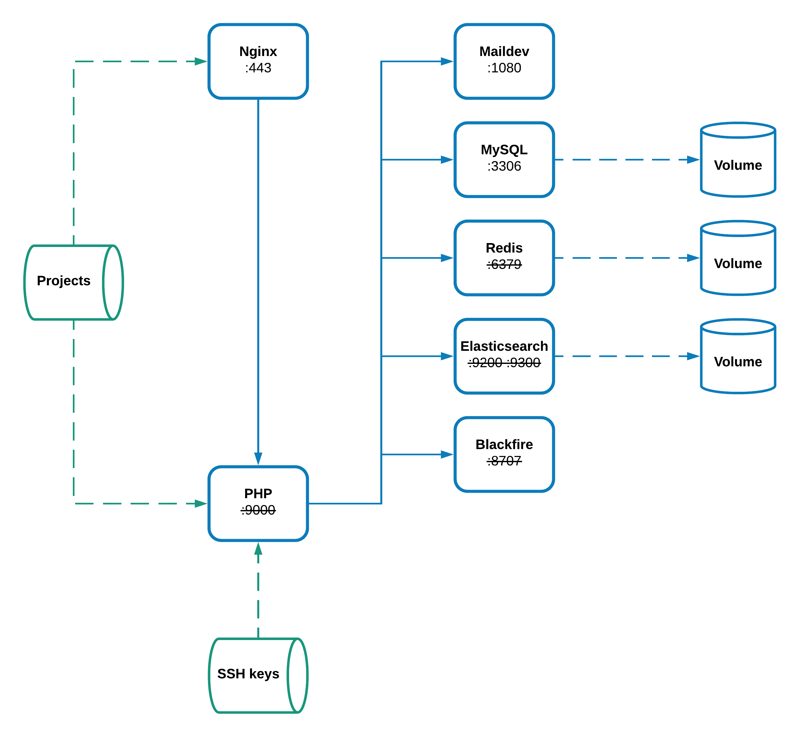

# Docker for Magento2  
This repository allows the creation of a Docker environment that meets
[Magento 2](https://devdocs.magento.com/guides/v2.4/install-gde/system-requirements-tech.html) requirements.

## Architecture

## Services
* `blackfire`: [blackfire/blackfire:latest](https://hub.docker.com/r/blackfire/blackfire/) image (application profiling).
* `elasticsearch`: [ajardin/magento2-elasticsearch:latest](https://hub.docker.com/r/ajardin/magento2-elasticsearch) custom image with some plugins (search engine).
* `maildev`: [djfarrelly/maildev:latest](https://hub.docker.com/r/djfarrelly/maildev/) image (emails debugging).
* `mysql`: [ajardin/magento2-mysql](https://hub.docker.com/r/ajardin/magento2-mysql) image (Magento database).
* `nginx`: [ajardin/magento2-nginx:latest](https://hub.docker.com/r/ajardin/magento2-nginx) custom image with HTTPS (web server).
* `php` : [ajardin/magento2-php](https://hub.docker.com/r/ajardin/magento2-php) custom image with additional extensions and Composer.
* `redis`: [redis:3.2-alpine](https://store.docker.com/images/redis) image (Magento session and caches).
* `synchro`: [ajardin/magento2-synchro:latest](https://hub.docker.com/r/ajardin/synchro) image (Synchronization using [Mutagen](https://mutagen.io/)).

## Documentation
> In order to make things more readable, and maintainable, the documentation has been migrated to
the [repository Wiki](https://github.com/EmakinaFR/docker-magento2/wiki). Where you will find all details about the 
installation process along the available instructions for the day-to-day work. 
